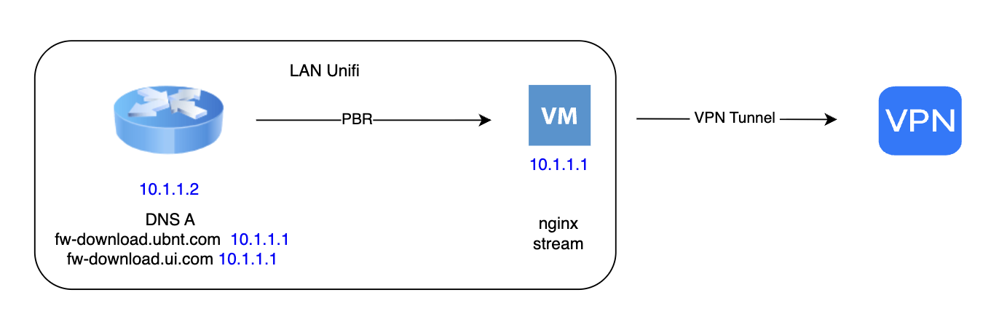
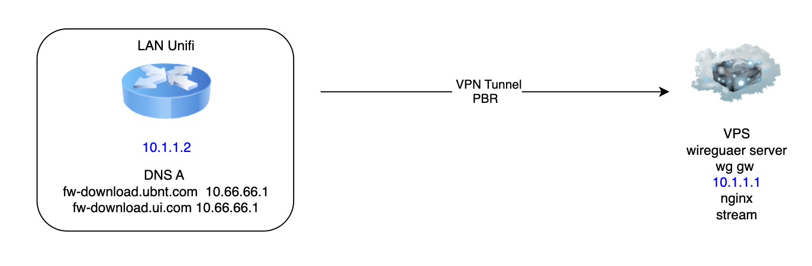
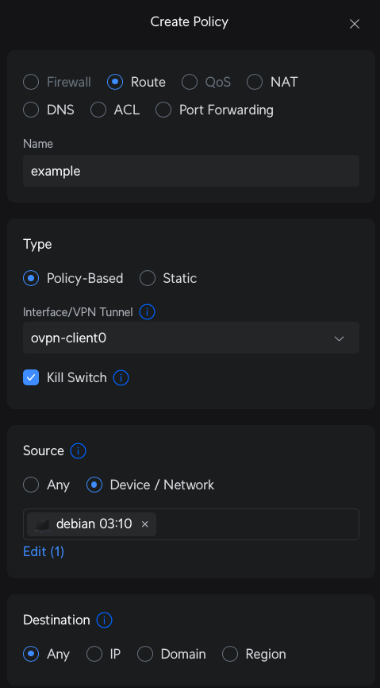
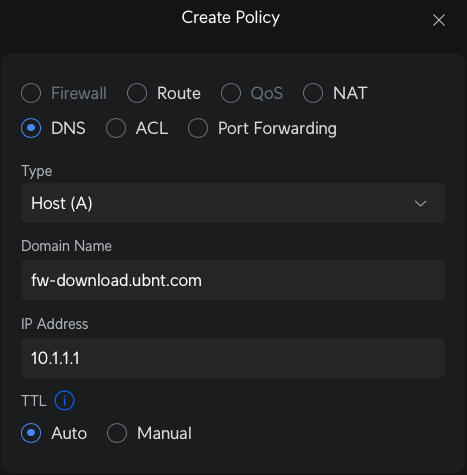
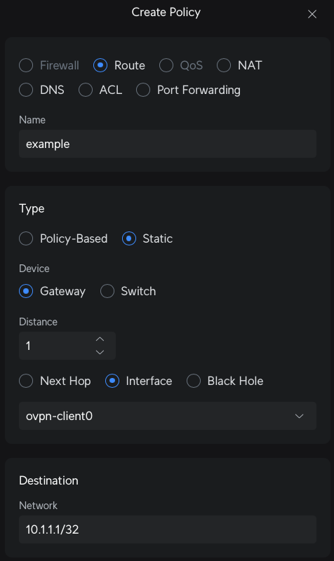

# Настройка обновления устройств Ubiquiti / Unifi при проблемах доступа к серверам обновлений

---
<a id="оглавление"></a>
## 📑 Оглавление
- 📘 [Введение](#введение)
- ⚙️ [Варианты настройки](#варианты-настройки)
- 🧰 [Что необходимо](#что-необходимо)
- 🏠 [Способ 1 — Без VPS, с туннелем](#способ-1--без-vps-с-туннелем)
- ☁️ [Способ 2 — С VPS](#способ-2--с-vps)
- 🐋 [Способ 3 — С VPS и docker](#способ-3--с-vps-и-docker)
- 🛠️ [Настройки](#настройки)
  - 🌍 [Настройка DNS](#настройка-dns)
  - 🧱 [Установка Nginx](#установка-nginx)
  - 🔧 [Подготовка конфигурации stream](#подготовка-конфигурации-stream)
  - 📂 [Выбор конфигурационного файла для stream](#выбор-конфигурационного-файла-для-stream)
- 🖥️ [Настройки в Network Application](#настройки-в-network-application)
  - 🛰️ [Настройка туннеля через Policy Engine в меню Policy Table](#настройка-туннеля-через-policy-engine-в-меню-policy-table)
  - 🧾 [Добавление DNS записей в Unifi](#добавление-dns-записей-в-unifi)
  - 🗺️ [Добавление статического маршрута](#добавление-статического-маршрута)
  - ✅ [Проверка работы](#проверка-работы)
- 💡 [Прочая полезная информация](#прочая-полезная-информация)
  - 🧩 [Полный список доменов по конфигурационным файлам](#полный-список-доменов-по-конфигурационным-файлам)

---
<a id="введение"></a>
## 📘 Введение
⬆️ [к оглавлению](#оглавление)

Описание процесса настройки обновления для устройств **Ubiquiti/Unifi**, для тех, у кого есть проблемы доступа к серверам обновлений **Ubiquiti**, размещённых на **Amazon**.

Суть всех настроек сводится к достижению одной цели — по нажатию кнопки **Update** все обновления устанавливаются, либо в случае **Install** инсталлируются.

---
<a id="варианты-настройки"></a>
## ⚙️ Варианты настройки
⬆️ [к оглавлению](#оглавление)

Настроить получение обновлений можно несколькими способами:

1. Для обновления **собственной сети**
2. Для обновления **нескольких сетей**
3. Аналогичное **пункту 2**, но с использованием **docker**

---
<a id="что-необходимо"></a>
## 🧰 Что необходимо
⬆️ [к оглавлению](#оглавление)

- **Способ 1**: нужен рабочий туннель, с публичным ip адресом, страны находящаяся **вне подсанкционного геоблока**, до которой поднят и работает туннель.
> ⚠️ **Примечание:**
> Данный способ подойдёт тем, у кого **нет своего VPS**, но есть возможность организации туннеля.
- **Способ 2**: нужна **рабочая VPS**, находящаяся **вне подсанкционного геоблока**, до которой поднят и работает туннель, и так же к ней есть доступ по ssh.
> ⚠️ **Примечание:**
> Данный способ подойдёт тем, у кого **есть VPS**, и к ней есть доступ по **SSH**.
- **Способ 3**: то же самое, что и 2 способ, только используется **docker**.
> ⚠️ **Примечание:**
> Данный способ подойдёт тем, у кого **есть VPS**, и к ней есть доступ по **SSH**.

---
<a id="способ-1--без-vps-с-туннелем"></a>
## 🏠 Способ 1 — Без VPS, с туннелем
⬆️ [к оглавлению](#оглавление)

> [!CAUTION]
> Будьте осторожны!
> Если Вы знаете владельца сервера VPN, и доверяете ему, то этот способ подойдёт Вам.
> Но, если вы не знаете владельца сервера VPN, то будьте осторожны, так как при обновлении через сторонние сервисы (сервера VPN), существует вероятность подмены, отдаваемых потребителю пакетов обновления, на модифицированные, с внедрённым вредоносным кодом.
> Самые безопасные сценарии обновления описаны в способах 2 и 3.

1. В собственной сети необходимо развернуть **виртуальную машину (Linux)**.
2. Преднастраиваем DNS на виртуальной машине, как написано [тут](#настройка-dns).
3. Устанавливаем nginx на виртуальной машине, как написано [тут](#установка-nginx).
4. Подготавливаем конфигурацию stream для nginx на виртуальной машине, как написано [тут](#подготовка-конфигурации-stream).
5. Выбираем конфигурационный файла для stream, как написано [тут](#выбор-конфигурационного-файла-для-stream).
6. Настраиваем туннель через Policy Engine, как написано [тут](#настройка-туннеля-через-policy-engine-в-меню-policy-table).
7. Добавляем DNS записи в Unifi, для доменов, которые будут заворачиваться в туннель, как написано [тут](#добавление-dns-записей-в-unifi).
8. Проверяем работу, как написано [тут](#проверка-работы).

Настройка завершена.



---
<a id="способ-2--с-vps"></a>
## ☁️ Способ 2 — С VPS
⬆️ [к оглавлению](#оглавление)

> ⚠️ **Примечание:**  
> Будем считать, что туннель поднят и настроены следующие адреса:
> - Ваш IP в туннеле: `10.1.1.2`  
> - IP сервера в туннеле: `10.1.1.1`

1. Подключаемся по ssh к VPS. Если nginx не установлен — ставим, и настраиваем поочередно, как написано [тут](#настройка-dns), [тут](#установка-nginx) и [тут](#подготовка-конфигурации-stream).
2. Выбираем конфигурационный файла для stream, как написано [тут](#выбор-конфигурационного-файла-для-stream).
3. Добавляем DNS записи в Unifi, для доменов, которые будут заворачиваться в туннель, как написано [тут](#добавление-dns-записей-в-unifi).
> ⚠️ **Примечание:**  
> В поле **IP Address** указываем **IP сервера** в туннеле
4. Добавляем статический маршрут до обратной стороны туннеля, как написано [тут](#добавление-статического-маршрута).
5. Проверяем работу, как написано [тут](#проверка-работы).

Настройка завершена.



---
<a id="способ-3--с-vps-и-docker"></a>
## Способ 3 - С VPS и docker
⬆️ [к оглавлению](#оглавление)

> ⚠️ **Примечание:**  
> Будем считать, что туннель поднят и настроены следующие адреса:
> - Ваш IP в туннеле: `10.1.1.2`  
> - IP сервера в туннеле: `10.1.1.1`

1. Подключаемся по ssh к VPS. Устанавливаем docker (если ещё не установлен) по [инструкции](https://docs.docker.com/engine/install/debian/).
2. Устанвливаем git.
```bash
sudo apt update && sudo apt install git
```
3. Клонируем репозиторий, и переходим в склонированный каталог.
```bash
git clone https://github.com/naem53/ubnt-update.git && cd ubnt-update
```
4. Запускаем стрим командой:
```bash
sudo docker compose up -d
```
5. Добавляем DNS записи в Unifi, для доменов, которые будут заворачиваться в туннель, как написано [тут](#добавление-dns-записей-в-unifi).
> ⚠️ **Примечание:**  
> В поле **IP Address** указываем **IP сервера** в туннеле
6. Добавляем статический маршрут до обратной стороны туннеля, как написано [тут](#добавление-статического-маршрута).
7. Проверяем работу, как написано [тут](#проверка-работы).

Настройка завершена.

---
<a id="настройки"></a>
## 🛠️ Настройки

<a id="настройка-dns"></a>
### 🌍 Настройка DNS
⬆️ [к оглавлению](#оглавление)

Обновляем список доступных пакетов:

```bash
sudo apt update
```

Меняем DNS сервер:

```bash
sudo echo "nameserver 9.9.9.9" > /etc/resolv.conf
```

<a id="установка-nginx"></a>
### 🧱 Установка Nginx
⬆️ [к оглавлению](#оглавление)

Устанавливаем **nginx** (либо **haproxy**, **traefik**, пример приведён на nginx и Debian):

```bash
sudo apt install nginx -y
```

Проверяем наличие модуля **ngx_stream_module**:

```bash
sudo nginx -V 2>&1 | grep --color stream
```

Если в выводе есть что-то вроде:

```
--with-stream=dynamic
```

или

```
--with-stream
```

значит поддержка stream есть.

Если модуль **динамический** (`--with-stream=dynamic`), его нужно явно загрузить в конфиге:

```bash
sudo nano /etc/nginx/nginx.conf
```

Добавляем (в самом начале, до блока `events`):

```nginx
load_module modules/ngx_stream_module.so;
```

Сохраняем файл и перезапускаем Nginx:

```bash
sudo systemctl restart nginx
```

<a id="подготовка-конфигурации-stream"></a>
### 🔧 Подготовка конфигурации stream
⬆️ [к оглавлению](#оглавление)

Создаём каталог для конфигов stream:

```bash
sudo mkdir /etc/nginx/stream.d || true
```

Редактируем `nginx.conf` и добавляем в самом конце:

```bash
sudo nano /etc/nginx/nginx.conf
```

Добавляем строку:

```nginx
include /etc/nginx/stream.d/*.conf;
```

<a id="выбор-конфигурационного-файла-для-stream"></a>
### 📂 Выбор конфигурационного файла для stream
⬆️ [к оглавлению](#оглавление)

Выберите один из конфигурационных файлов в зависимости от необходимости:

1. `conf/nginx/stream.d/stream-ubnt.conf` — стрим **только fw-download.ubnt.com** и **fw-download.ui.com**  
2. `conf/nginx/stream.d/stream-ubnt-only-dl.conf` — стрим как в пункте 1 + **beta**, **early access**, **release candidate**  
3. `conf/nginx/stream.d/stream-all.conf` — стрим всего, включая **fw-update.ubnt.com** и **fw-update.ui.com** (данный вариант не рекомендуется)

Пример приведён на основе **первого способа** — `conf/nginx/stream.d/stream-ubnt.conf`.

Копируем выбранный файл конфигурации в каталог stream:

```bash
sudo cp conf/nginx/stream.d/stream-ubnt.conf /etc/nginx/stream.d/
```

Перезапускаем Nginx:

```bash
sudo systemctl restart nginx
```

---
<a id="настройки-в-network-application"></a>
## 🖥️ Настройки в Network Application

<a id="настройка-туннеля-через-policy-engine-в-меню-policy-table"></a>
### 🛰️ Настройка туннеля через Policy Engine в меню Policy Table
⬆️ [к оглавлению](#оглавление)

Теперь нужно завернуть трафик с созданной виртуальной машины в туннель.

В **Network Application** переходим:  
**Settings → Policy Table → Create Net Policy → Route**

В боковой панели выбираем:

- **Type policy**: `Route`  
- **Name**: любое осмысленное имя  
- **Type**: `Policy-Based`  
- **Interface/VPN Tunnel**: имя туннеля до VPS  
- **Source**: `Device/Network` → выбираем виртуальную машину (по IP или другому параметру)  
- **Destination**: `Any`

Нажимаем **Add** — готово.



<a id="добавление-dns-записей-в-unifi"></a>
### 🧾 Добавление DNS записей в Unifi
⬆️ [к оглавлению](#оглавление)

> ⚠️ **Примечание:**  
> Если Вы используете **вариант 2 - С VPS или 3 - С VPS и docker** то в поле **IP Address** нужно указывать ip сервера, обратной стороны туннеля.

В **Network Application** нажимаем:  
**Settings → Policy Table → Create Net Policy → DNS**

В боковой панели выбираем:
- **Type**: `Host (A)`  
- **Domain Name**: `fw-download.ubnt.com`  
- **IP Address**: локальный IP виртуальной машины

Жмём **Add** — готово.



Повторяем то же самое и для домена `fw-download.ui.com`.

> ⚠️ **Примечание:**  
> Если используются другие конфигурационные файлы nginx (`stream-ubnt-all.conf` или `stream-ubnt-only-dl.conf`), аналогичные действия выполняются для всех доменов, перечисленных в конфиге.

<a id="добавление-статического-маршрута"></a>
### 🗺️ Добавление статического маршрута
⬆️ [к оглавлению](#оглавление)

Иногда может потребоваться добавить **static route** для обратной стороны туннеля.

В **Network Application** переходим:  
**Settings → Policy Table → Create Net Policy → Route**

В боковой панели выбираем:
- **Type policy**: `Route`  
- **Name**: любое осмысленное  
- **Type**: `Static`  
- **Interface/VPN Tunnel**: имя туннеля до VPS  
- **Device**: `Gateway`  
- **Distance**: `1`  
- **Interface**: выбираем имя туннеля

Жмём **Add** — готово.



<a id="проверка-работы"></a>
### ✅ Проверка работы
⬆️ [к оглавлению](#оглавление)

Для проверки идём:  
**Settings → Control Plane → Updates**  
Пробуем обновиться, либо установить необходимые пакеты.

---
<a id="прочая-полезная-информация"></a>
## 💡 Прочая полезная информация

<a id="полный-список-доменов-по-конфигурационным-файлам"></a>
### 🧩 Полный список доменов по конфигурационным файлам
⬆️ [к оглавлению](#оглавление)

### `example/conf/nginx/stream.d/stream-ubnt.conf`
- fw-download.ubnt.com  
- fw-download.ui.com  

### `example/conf/nginx/stream.d/stream-ubnt-only-dl.conf`
- fw-download.ubnt.com  
- fw-download.ui.com  
- apt.artifacts.ui.com  
- apt-release-candidate.artifacts.ui.com  
- apt-beta.artifacts.ui.com  

### `example/conf/nginx/stream.d/stream-all.conf`
- fw-download.ubnt.com  
- fw-download.ui.com  
- fw-update.ubnt.com  
- fw-update.ui.com  
- apt.artifacts.ui.com  
- apt-release-candidate.artifacts.ui.com  
- apt-beta.artifacts.ui.com  

> ⚠️ **Примечание:**  
> Заворачивать домены `fw-update.ubnt.com` и `fw-update.ui.com` в стрим **не имеет смысла** — эти домены не заблокированы, и **Network Application** получает сведения напрямую.
